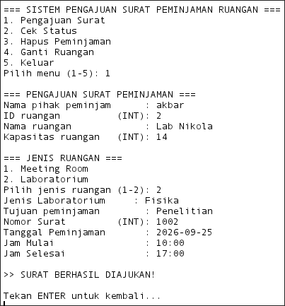
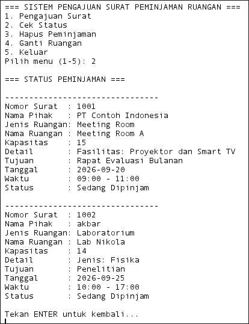
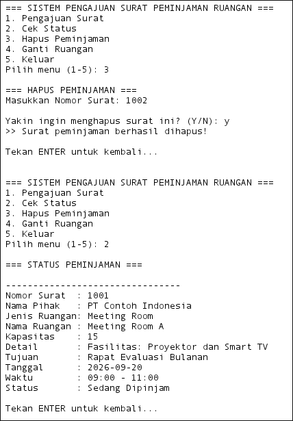
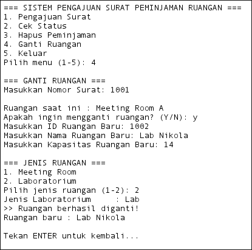
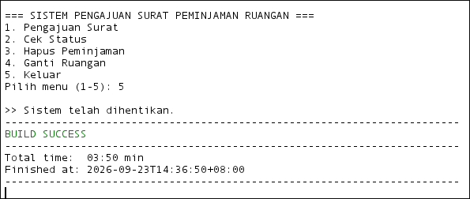
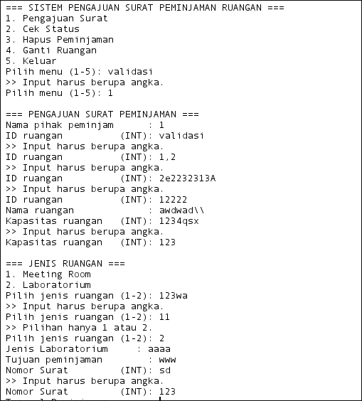
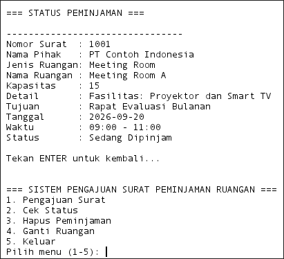

# Minpro-2-PBO-Sistem-peminjaman-ruangan-di-lingkungan-kampus-unmul

# Sistem Pengajuan Surat Peminjaman Ruangan

Aplikasi **console-based** berbasis Java untuk mengelola pengajuan surat peminjaman ruangan (Meeting Room dan Laboratorium). Program ini dibangun dengan menerapkan konsep **Pemrograman Berorientasi Objek (OOP)** secara penuh — *encapsulation*, *inheritance*, *polymorphism* — serta pola arsitektur **MVC (Model-View-Controller)**.

## Daftar Isi

- [Fitur Utama](#fitur-utama)
- [Struktur Project (Pola MVC)](#struktur-project-pola-mvc)
- [Alur Kerja Program](#alur-kerja-program)
- [Konsep OOP yang Diterapkan](#konsep-oop-yang-diterapkan)
  - [Validasi Input](#1-validasi-input)
  - [Access Modifier](#2-access-modifier)
  - [Encapsulation](#3-encapsulation)
  - [Inheritance](#4-inheritance)
  - [Polymorphism](#5-polymorphism)
  - [Dummy Data](#6-dummy-data)
- [Penjelasan Menu Program](#penjelasan-menu-program)
- [Cara Menjalankan Program](#cara-menjalankan-program)

---

## Fitur Utama

1. **Pengajuan Surat** — mengajukan surat peminjaman ruangan baru.
2. **Cek Status** — melihat seluruh daftar peminjaman yang sudah diajukan.
3. **Hapus Peminjaman** — membatalkan/menghapus surat peminjaman.
4. **Ganti Ruangan** — mengganti ruangan pada surat peminjaman yang sudah ada.
5. **Keluar** — menghentikan program.

---

## Struktur Project (Pola MVC)

Program ini disusun mengikuti pola **MVC (Model-View-Controller)**, di mana tanggung jawab program dipisah ke dalam tiga package berbeda agar kode lebih rapi, mudah dipelihara, dan setiap bagian punya tugas yang jelas.

```
com.mycompany.peminjamanruangan
│
├── Peminjamanruangan.java        # Entry point (method main)
│
├── model/                        # MODEL
│   ├── Ruangan.java               # Superclass abstrak
│   ├── MeetingRoom.java           # Subclass Ruangan
│   ├── Laboratorium.java          # Subclass Ruangan
│   ├── Jadwal.java                # Objek jadwal peminjaman
│   └── Peminjaman.java            # Objek surat peminjaman
│
├── View/                          # VIEW
│   └── peminjamanView.java        # Seluruh tampilan & pembacaan input
│
└── controller/                    # CONTROLLER
    └── PeminjamanController.java  # Alur program & logika proses
```

### Tanggung Jawab Setiap Package

| Package | Tanggung Jawab |
|---|---|
| `model` | Menyimpan **struktur data** dan **atribut objek** (Ruangan, Peminjaman, Jadwal, dsb). Tidak berisi logika alur program maupun tampilan. |
| `View` | Menangani **semua interaksi dengan pengguna** — menampilkan menu, membaca input, mencetak pesan dan status ke layar. `View` tidak menyimpan data dan tidak memutuskan alur program. |
| `controller` | Mengatur **alur program dan logika bisnis** — memanggil `View` untuk berinteraksi dengan pengguna, menyimpan/mengubah/menghapus data pada `ArrayList`, dan memutuskan objek `model` apa yang harus dibuat. |

Hubungan antar-class: `PeminjamanController` memegang referensi ke `peminjamanView` dan sebuah `ArrayList<Peminjaman>`. Setiap `Peminjaman` memegang referensi ke satu objek `Ruangan` (bisa `MeetingRoom` atau `Laboratorium`) dan satu objek `Jadwal`. `Peminjamanruangan` (main) hanya bertugas merangkai ketiganya lalu menjalankan `controller.jalankan()`.

```java
public static void main(String[] args) {
    Scanner scanner=new Scanner(System.in);
    peminjamanView view=new peminjamanView(scanner);
    PeminjamanController controller=new PeminjamanController(view);
    controller.jalankan();
    scanner.close();
}
```

`main` tidak mengandung logika apa pun — ia hanya menyusun objek `View` dan `Controller`, lalu menyerahkan kendali sepenuhnya ke `controller.jalankan()`. Ini adalah ciri khas pola MVC: titik masuk program tetap tipis dan bersih.


---

## Alur Kerja Program

Alur program dari program dijalankan hingga dihentikan adalah sebagai berikut:

1. **Program dijalankan** melalui method `main()` di `Peminjamanruangan.java`.
2. Objek `peminjamanView` dan `PeminjamanController` dibuat. Saat `PeminjamanController` dibuat, constructor-nya otomatis memanggil `Dummy()` sehingga satu data peminjaman awal langsung tersedia di `ArrayList`.
3. `controller.jalankan()` dipanggil, masuk ke **loop utama** (`while(berjalan)`), yang terus menampilkan menu selama pengguna belum memilih *Keluar*.
4. Setiap perulangan, `view.tampilkanMenu()` mencetak 5 pilihan menu, lalu `view.bacaPilihanMenu()` membaca dan **memvalidasi** input pengguna (harus angka 1–5).
5. Berdasarkan pilihan, `switch` mengarahkan alur ke salah satu method controller: `ajukanSurat()`, `tampilkanStatus()`, `hapusSurat()`, `gantiRuangan()`, atau menghentikan loop.
6. Untuk menu yang melibatkan input data (mis. Pengajuan Surat), controller memanggil serangkaian method `View` untuk membaca setiap field satu per satu — setiap input divalidasi sebelum lanjut ke field berikutnya.
7. Setelah semua data valid terkumpul, controller membungkusnya menjadi objek `model` (`Ruangan`/`MeetingRoom`/`Laboratorium`, `Jadwal`, `Peminjaman`) lalu menyimpannya ke `ArrayList<Peminjaman> daftarPeminjaman`.
8. Untuk menu yang membaca data (Cek Status), controller mengiterasi `ArrayList` dan meminta `View` mencetak setiap objek.
9. Untuk menu yang mengubah data (Hapus, Ganti Ruangan), controller mencari objek yang sesuai di `ArrayList` berdasarkan nomor surat, lalu memodifikasi atau menghapusnya.
10. Ketika pengguna memilih menu **5 (Keluar)**, flag `berjalan` diubah menjadi `false`, loop `while` berhenti, pesan penutup dicetak, dan `main()` menutup `Scanner` — program selesai.

```java
public void jalankan() {
    boolean berjalan=true;
    while(berjalan) {
        view.tampilkanMenu();
        switch(view.bacaPilihanMenu()) {
            case 1 -> ajukanSurat();
            case 2 -> tampilkanStatus();
            case 3 -> hapusSurat();
            case 4 -> gantiRuangan();
            case 5 -> {
                berjalan=false;
                view.pesan("\n>> Sistem telah dihentikan.");
            }
        }
    }
}
```

Method `jalankan()` inilah **jantung program** — semua fitur pada akhirnya dipicu dari loop dan `switch` ini.

---

## Penjelasan Menu Program

### 1. Pengajuan Surat

Pengguna diminta mengisi data secara berurutan: nama pihak, ID ruangan (harus unik), nama ruangan, kapasitas, jenis ruangan (Meeting Room/Laboratorium), detail sesuai jenisnya, tujuan peminjaman, nomor surat (harus unik), tanggal, jam mulai, dan jam selesai. Setiap input divalidasi sebelum program lanjut ke input berikutnya. Setelah semua data valid, controller membentuk objek `Ruangan` (sesuai jenis yang dipilih), objek `Jadwal`, lalu membungkus keduanya bersama data lain ke dalam objek `Peminjaman` baru yang ditambahkan ke `daftarPeminjaman`.

```java
Ruangan ruangan=jenis==1
        ?new MeetingRoom(idRuangan,namaRuangan,kapasitas,false,detail)
        :new Laboratorium(idRuangan,namaRuangan,kapasitas,false,detail);

Jadwal jadwal=new Jadwal(tanggal,jamMulai,jamSelesai);
daftarPeminjaman.add(
    new Peminjaman(namaPihak,tujuan,nomorSurat,ruangan,jadwal)
);
```

Ruangan baru selalu dibuat dengan status `tersedia=false`, karena begitu diajukan, ruangan tersebut dianggap sedang dipesan/dipinjam — bukan lagi kosong.



### 2. Cek Status

Controller mengecek apakah `daftarPeminjaman` kosong; jika tidak, ia mengiterasi seluruh isi list dan meminta `View` mencetak detail setiap `Peminjaman` satu per satu lewat `view.tampilkanStatus(p)`.

```java
private void tampilkanStatus() {
    if(daftarPeminjaman.isEmpty()) {
        view.pesan(">> Belum ada data peminjaman.");
    } else {
        for(Peminjaman p:daftarPeminjaman)
            view.tampilkanStatus(p);
    }
    view.tekanEnter();
}
```

Menu ini murni operasi **baca (Read)** — tidak ada data yang diubah, hanya ditampilkan dari `ArrayList` yang sudah tersimpan sebelumnya (baik dari dummy data maupun dari Pengajuan Surat).



### 3. Hapus Peminjaman

Pengguna memasukkan nomor surat yang ingin dihapus. Controller mencari `Peminjaman` yang cocok lewat `cariPeminjaman()`; jika ditemukan, pengguna diminta konfirmasi `Y/N` sebelum data benar-benar dihapus dari `ArrayList`.

```java
private void hapusSurat() {
    int nomor=view.bacaInt("Masukkan Nomor Surat: ");
    Peminjaman p=cariPeminjaman(nomor);

    if(p==null) {
        view.pesan(">> Nomor surat tidak ditemukan.");
    } else if(view.bacaKonfirmasi(
        "\nYakin ingin menghapus surat ini? (Y/N): "
    ).equalsIgnoreCase("Y")) {
        daftarPeminjaman.remove(p);
        view.pesan(">> Surat peminjaman berhasil dihapus!");
    } else {
        view.pesan(">> Penghapusan dibatalkan.");
    }
    view.tekanEnter();
}
```

Langkah konfirmasi ini mencegah penghapusan data secara tidak sengaja — data hanya benar-benar hilang dari `ArrayList` jika pengguna secara eksplisit mengetik `Y`.



### 4. Ganti Ruangan

Controller mencari `Peminjaman` berdasarkan nomor surat, menampilkan ruangan yang sedang dipakai, meminta konfirmasi, lalu membaca data ruangan baru (ID, nama, kapasitas, jenis, detail) dengan validasi yang sama seperti Pengajuan Surat. ID ruangan baru divalidasi agar tidak bentrok dengan peminjaman **lain** (bukan peminjaman yang sedang diubah itu sendiri):

```java
if(idBaruSudahDipakaiOlehPeminjamanLain(idBaru,p)) {
    view.pesan(">> ID ruangan tersebut sudah digunakan.");
    continue;
}
```

Setelah data valid, objek `Ruangan` yang benar-benar baru dibuat dan dipasang ke `Peminjaman` yang sama lewat setter:

```java
Ruangan ruangan=jenis==1
        ?new MeetingRoom(idBaru,nama,kapasitas,false,detail)
        :new Laboratorium(idBaru,nama,kapasitas,false,detail);

p.setRuangan(ruangan);
```

Perhatikan bahwa `Peminjaman` tidak diubah objeknya — hanya atribut `ruangan` di dalamnya yang diganti. Ini kembali menunjukkan manfaat **encapsulation**: perubahan dilakukan lewat `setRuangan()`, bukan membongkar objek `Peminjaman` lama dan membuat yang baru.



### 5. Keluar

Ketika pengguna memilih menu 5, `case 5` pada `switch` di dalam `jalankan()` mengubah variabel `berjalan` menjadi `false` dan mencetak pesan penutup:

```java
case 5 -> {
    berjalan=false;
    view.pesan("\n>> Sistem telah dihentikan.");
}
```

Karena kondisi `while(berjalan)` kini bernilai `false`, loop utama berhenti, `jalankan()` selesai dieksekusi, kendali kembali ke `main()`, `scanner.close()` dipanggil, dan program berakhir sepenuhnya.



---

## Cara Menjalankan Program

1. Pastikan **JDK 17 atau lebih baru** sudah terpasang (program menggunakan `switch` arrow syntax dan `java.time`).
2. Clone repository ini, lalu compile seluruh file `.java` sesuai struktur package-nya:
   ```bash
   javac -d out $(find src -name "*.java")
   ```
3. Jalankan class utama:
   ```bash
   java -cp out com.mycompany.peminjamanruangan.Peminjamanruangan
   ```
4. Ikuti menu yang muncul di terminal untuk mencoba setiap fitur.

---

## Konsep OOP yang Diterapkan

### 1. Validasi Input

Semua pembacaan input pengguna dipusatkan di `peminjamanView`, masing-masing dibungkus dalam `while(true)` yang hanya berhenti (`return`/`break`) ketika input dinyatakan valid. Ini memastikan `Controller` tidak pernah menerima data mentah yang belum tervalidasi.

| Validasi | Method | Aturan |
|---|---|---|
| String tidak boleh kosong | `bacaString()` | Input di-*trim*, ditolak jika `isEmpty()` |
| Input harus angka | `bacaInt()` | Menangkap `NumberFormatException` dari `Integer.parseInt()` |
| Format tanggal | `bacaTanggal()` | Harus sesuai pola `yyyy-MM-dd`, divalidasi dengan `LocalDate.parse()` |
| Format jam | `bacaJam()` | Harus sesuai pola `HH:mm`, divalidasi dengan `LocalTime.parse()` |
| Konfirmasi Y/N | `bacaKonfirmasi()` | Hanya menerima `"Y"` atau `"N"` (tidak *case-sensitive*) |
| Pilihan menu | `bacaPilihanMenu()` | Harus berada di rentang 1–5 |
| Jenis ruangan | `pilihJenisRuangan()` | Harus `1` (Meeting Room) atau `2` (Laboratorium) |

Contoh — validasi angka pada `bacaInt()`:

```java
public int bacaInt(String pesan) {
    while(true) {
        System.out.print(pesan);
        try {
            return Integer.parseInt(scanner.nextLine().trim());
        } catch(NumberFormatException e) {
            System.out.println(">> Input harus berupa angka.");
        }
    }
}
```

Jika pengguna mengetik teks selain angka, `Integer.parseInt()` melempar `NumberFormatException`, ditangkap oleh `catch`, pesan error dicetak, dan `while(true)` mengulang pembacaan — bukannya program *crash*.

Selain validasi format, `PeminjamanController` juga menerapkan **validasi bisnis** yang tidak bisa dilakukan `View` sendirian, karena butuh akses ke data yang tersimpan:

- **ID ruangan dan nomor surat harus unik** (dicek lewat `idRuanganSudahDigunakan()` dan `nomorSuratSudahDigunakan()`).
- **Jam selesai harus setelah jam mulai**, dicek dengan membandingkan dua objek `LocalTime`:

```java
while(true) {
    jamSelesai=view.bacaJam("Jam Selesai              : ");
    LocalTime mulai=LocalTime.parse(
        jamMulai,DateTimeFormatter.ofPattern("HH:mm")
    );
    LocalTime selesai=LocalTime.parse(
        jamSelesai,DateTimeFormatter.ofPattern("HH:mm")
    );
    if(selesai.isAfter(mulai)) break;
    view.pesan(">> Jam selesai harus setelah jam mulai.");
}
```

`selesai.isAfter(mulai)` mengembalikan `false` jika jam selesai sama dengan atau lebih awal dari jam mulai — dalam kondisi itu, loop mengulang permintaan input alih-alih melanjutkan dengan data yang tidak logis.



### 2. Access Modifier

Program secara konsisten menggunakan dua access modifier: `private` dan `public`.

- **`private`** dipakai untuk seluruh **atribut/field** di semua class model (`Ruangan`, `Peminjaman`, `Jadwal`, dll.) serta untuk `ArrayList<Peminjaman> daftarPeminjaman` di `PeminjamanController`, dan method-method bantu internal controller seperti `cariPeminjaman()`, `nomorSuratSudahDigunakan()`, `Dummy()`. Tujuannya agar data dan logika internal **tidak bisa diakses atau diubah langsung dari luar class**, sehingga perubahan data hanya bisa lewat method yang sudah disediakan.
- **`public`** dipakai untuk **constructor**, **getter/setter**, dan method yang memang harus bisa dipanggil dari class lain — misalnya `jalankan()` di controller (dipanggil dari `main`), atau seluruh method di `peminjamanView` (dipanggil dari `controller`).

Contoh pada `PeminjamanController`:

```java
private final ArrayList<Peminjaman> daftarPeminjaman=new ArrayList<>();
private final peminjamanView view;
```

`daftarPeminjaman` bersifat `private` karena hanya boleh dimodifikasi lewat method-method di dalam `PeminjamanController` sendiri (`ajukanSurat()`, `hapusSurat()`, dst.) — class lain, termasuk `View`, tidak pernah menyentuh `ArrayList` ini secara langsung. Ini menjaga agar semua perubahan data melewati satu jalur logika yang konsisten.

### 3. Encapsulation

Encapsulation diterapkan di **semua class model** dengan pola yang sama: atribut dideklarasikan `private`, lalu akses ke atribut tersebut hanya disediakan lewat **getter** dan **setter** `public`. Contoh pada `Ruangan.java`:

```java
private int idRuangan;
private String namaRuangan;
private int kapasitas;
private boolean tersedia;

public int getIdRuangan() {
    return idRuangan;
}

public void setIdRuangan(int idRuangan) {
    this.idRuangan = idRuangan;
}
```

Karena `idRuangan` bersifat `private`, class lain seperti `PeminjamanController` **tidak bisa menulis** `ruangan.idRuangan = 999;` secara langsung — satu-satunya cara mengubah nilainya adalah melalui `setIdRuangan()`. Pola yang sama diterapkan pada `Peminjaman.java` (`namaPihak`, `tujuan`, `nomorSurat`, `ruangan`, `jadwal`) dan `Jadwal.java` (`tanggal`, `jamMulai`, `jamSelesai`). Encapsulation inilah yang memungkinkan fitur **Ganti Ruangan** bekerja secara aman — controller mengganti objek `Ruangan` pada sebuah `Peminjaman` lewat `p.setRuangan(ruangan)`, bukan dengan mengubah field secara langsung.

### 4. Inheritance

Program memiliki satu **superclass** (`Ruangan`) dan dua **subclass** (`MeetingRoom` dan `Laboratorium`) yang mewarisi seluruh atribut dan method dari `Ruangan`, lalu menambahkan atributnya sendiri.

```java
public abstract class Ruangan {
    private int idRuangan;
    private String namaRuangan;
    private int kapasitas;
    private boolean tersedia;
    // constructor, getter, setter ...
}
```

```java
public class MeetingRoom extends Ruangan {
    private String fasilitas;

    public MeetingRoom(int idRuangan, String namaRuangan, int kapasitas,
                        boolean tersedia, String fasilitas) {
        super(idRuangan, namaRuangan, kapasitas, tersedia);
        this.fasilitas = fasilitas;
    }
    // ...
}
```

```java
public class Laboratorium extends Ruangan {
    private String jenisLaboratorium;

    public Laboratorium(int idRuangan, String namaRuangan, int kapasitas,
                         boolean tersedia, String jenisLaboratorium) {
        super(idRuangan, namaRuangan, kapasitas, tersedia);
        this.jenisLaboratorium = jenisLaboratorium;
    }
    // ...
}
```

Kata kunci `extends Ruangan` menandakan `MeetingRoom` dan `Laboratorium` **mewarisi** `idRuangan`, `namaRuangan`, `kapasitas`, dan `tersedia` beserta seluruh getter/setter-nya dari `Ruangan`, tanpa perlu menulis ulang kode yang sama. Pemanggilan `super(...)` di baris pertama constructor mengirim empat parameter umum tersebut ke constructor `Ruangan`, sementara masing-masing subclass hanya perlu menangani atributnya yang unik (`fasilitas` untuk `MeetingRoom`, `jenisLaboratorium` untuk `Laboratorium`).

### 5. Polymorphism

Polymorphism diterapkan melalui **method overriding**. `Ruangan` mendeklarasikan dua method abstrak yang **wajib** diimplementasikan berbeda oleh setiap subclass:

```java
public abstract String getJenisRuangan();
public abstract String getDetailRuangan();
```

`MeetingRoom` meng-*override* keduanya:

```java
@Override
public String getJenisRuangan() {
    return "Meeting Room";
}

@Override
public String getDetailRuangan() {
    return "Fasilitas: " + fasilitas;
}
```

`Laboratorium` meng-*override* dengan isi yang berbeda:

```java
@Override
public String getJenisRuangan() {
    return "Laboratorium";
}

@Override
public String getDetailRuangan() {
    return "Jenis Laboratorium: " + jenisLaboratorium;
}
```

Anotasi `@Override` menandai bahwa method ini **menimpa** versi abstrak dari `Ruangan`. Akibatnya, ketika `peminjamanView.tampilkanStatus()` memanggil `p.getRuangan().getJenisRuangan()`, Java menentukan **method mana yang benar-benar dijalankan berdasarkan tipe objek sesungguhnya saat runtime**, bukan berdasarkan tipe variabel yang dideklarasikan. Jika `p.getRuangan()` adalah objek `MeetingRoom`, outputnya `"Meeting Room"`; jika objeknya `Laboratorium`, outputnya `"Laboratorium"` — dengan baris kode pemanggilan yang persis sama.

Polymorphism ini juga terlihat lewat **upcasting** — objek `MeetingRoom` atau `Laboratorium` disimpan menggunakan referensi bertipe `Ruangan`, seperti di `PeminjamanController.ajukanSurat()`:

```java
Ruangan ruangan=jenis==1
        ?new MeetingRoom(idRuangan,namaRuangan,kapasitas,false,detail)
        :new Laboratorium(idRuangan,namaRuangan,kapasitas,false,detail);
```

Variabel `ruangan` bertipe `Ruangan`, tapi objek yang sebenarnya ia tunjuk bisa berupa `MeetingRoom` **atau** `Laboratorium`, tergantung pilihan pengguna (`jenis`). Class `Peminjaman` bahkan hanya perlu menyimpan referensi `Ruangan` (`private Ruangan ruangan;`) tanpa perlu tahu — atau peduli — apakah objek itu sebenarnya `MeetingRoom` atau `Laboratorium`. Inilah inti polymorphism: satu tipe referensi, banyak bentuk perilaku nyata.


### 6. Dummy Data

Agar fitur **Cek Status** langsung punya data untuk ditampilkan tanpa mengharuskan pengguna mengajukan surat terlebih dahulu, `PeminjamanController` memanggil method `Dummy()` di dalam constructor-nya:

```java
public PeminjamanController(peminjamanView view) {
    this.view=view;
    Dummy();
}

private void Dummy() {
    MeetingRoom ruangan=new MeetingRoom(
        201,"Meeting Room A",15,false,"Proyektor dan Smart TV"
    );
    Jadwal jadwal=new Jadwal("2026-09-20","09:00","11:00");
    daftarPeminjaman.add(new Peminjaman(
        "PT Contoh Indonesia",
        "Rapat Evaluasi Bulanan",
        1001,
        ruangan,
        jadwal
    ));
}
```

Karena `Dummy()` dipanggil **sebelum** `jalankan()` menampilkan menu apa pun, satu record peminjaman (nomor surat `1001`, ruangan `Meeting Room A`) sudah ada di `daftarPeminjaman` sejak program pertama kali berjalan. Ini berguna untuk demonstrasi/pengujian: begitu pengguna memilih menu **Cek Status**, data langsung muncul tanpa perlu input manual terlebih dahulu.



